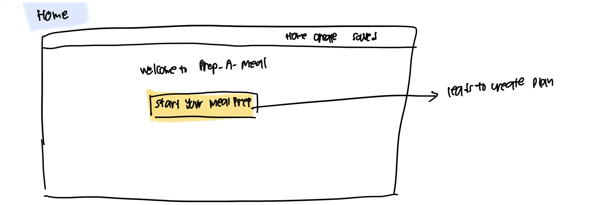
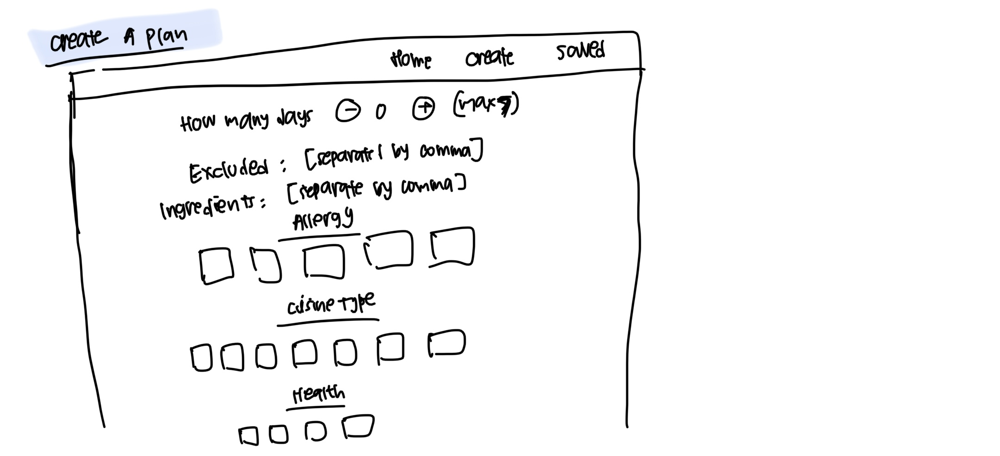
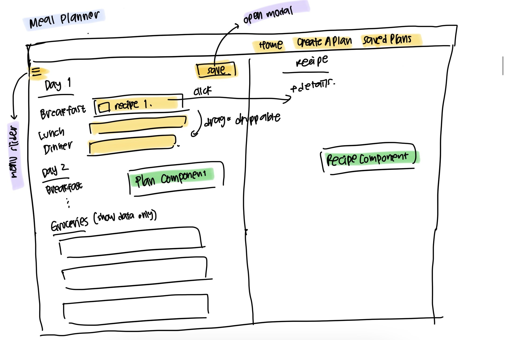
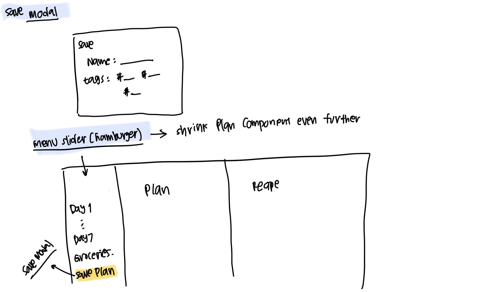
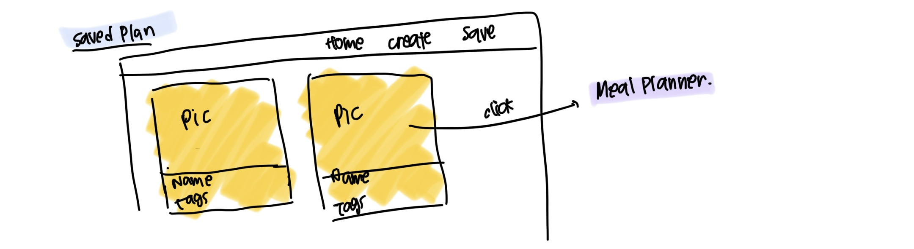
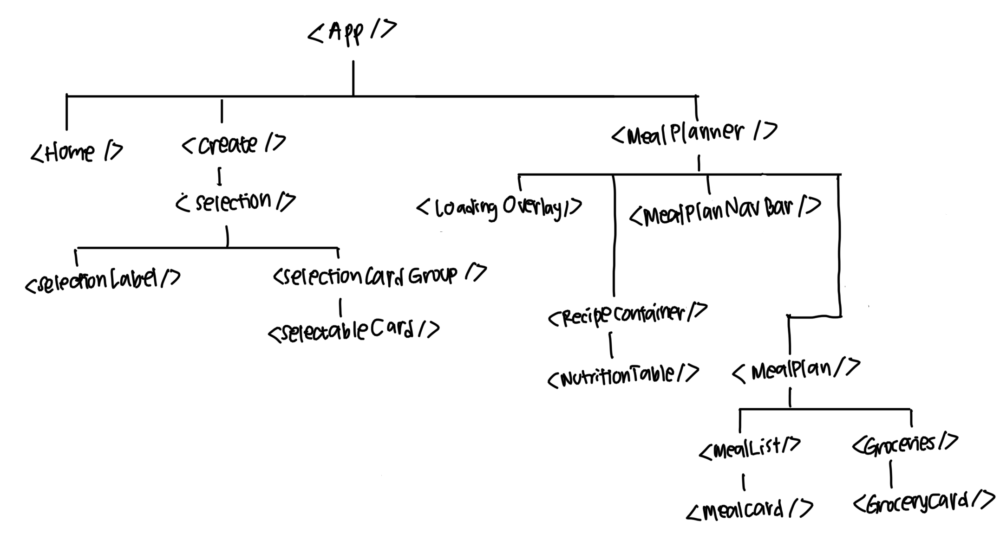
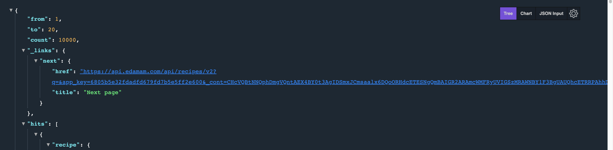

# Prep-a-meal

## Description

A meal planner app, built using React and Edamam API, in which user can get a list of recipe based on their diet and health. This project is created as part of General Assembly's Software Engineering Immersive program for its front-end development unit

### Technical Used

- React
- react-router-dom
- react-beautiful-dnd
- Material UI
- Tailwind CSS

### Wireframes

Here are some wireframes that I first created when planning the app. Some feature, i.e. Save Modal and Save page are not implemented yet at the time of writing as I was overthinking my project which led to overcomplicating the project. There are some possibility that these features will be implemented in the future so do look out for it 😉











Component Tree:


### User Stories

- User should be able to create a plan by filling in a form, and get their meal plan based on the number of days in the week they want to plan (min. 1 day, max. 7 days), how many meals they want to have in a day (breakfast-lunch-dinner or breakfast-lunch-dinner-snack-teatime), diet (e.g. balanced, low-fat), and health/allergy (e.g. egg-free, DASH, etc)
- User should be able to easily click on the available options in the form. As there is "none" option for diet and health, when user click "none", any other options that they choose should be unselected
- User should be able to rearrange their meal plan by dragging and dropping the meal cards in the Meal Planner page
- User should be able to view the ingredients, recipe, and nutritional value by double-clicking the meal card
- User should be able to read the list of groceries for their meals in the week
- User should be able to see whether they can find the ingredient in their favorite supermarket
- User should be able to quickly navigate through the plan using the Navigation bar in the Meal Planner page

---

## Development Process

0. Plan the whole thing, even though not everything gets implemented
   Spent the weekends searching and comparing multiple recipe API, including API from Spoonacular, Open Food API, Edamam API, Tasty API, and many more. I decided to use Edamam API, particularly the Recipe endpoint, for its extensive list of diet and health labels, as well as the nutritional value data. Then, I created the wireframe to visualize the app and create a component tree.

1. Fetching data from the API
   This step includes creating an account to get an API key, trying out the API, and using `Fetch API` in the script to get the data. As there's a 10,000 API call limit per month for the free version of Edamam API, I had to emulate the API call using a dummy API and copy the data I got from trying out the API so that I can work on the data presentation without having to call the API multiple times.

   Edamam API only returns 20 recipes per call, and to get another 20 recipes (so that there are more options to randomize from when generating lunch, dinner, snack, and teatime), I need to call the next page API specified in the data, as shown in the screenshot below
   

   In order to do this, I created another state called `nextAPI`, which is initialized with the object `{ none: "" }`, and use `useEffect` with the key as dependency.

   Data fetch is handled by `fetchData()` function, which accepts 3 parameters:

   - `url`: the API URL
   - `mealType`: whether it's breakfast, lunch (which also includes dinner), or snack (includes teatime)
   - `callback`: a function, which sets `isLoading` to `false` when the next data is fetched

   When there are changes to the `nextAPI` key, the code block in useEffect is run, and the next 20 recipes are fetched.

   You can refer to `/src/MealPlanner.js` on how this is implemented

2. Create `Selection` component and `Create` page

   The first component that I built was the `Selection` component, which is used later in the app to let users to choose from the available diet, health and allergy option. The data needed for this component are passed down from `Create` page, which includes:

   - `title`: the title that describes the selection, which will be rendered by `SelectionLabel`
   - `types`: options that user can choose from (e.g. dairy-free, sugar-concious, etc)
   - `multiple`: indicator whether user can select multiple options (boolean: `true` if user can select multiple, `false` if user can only select 1)
   - `id`: identifier of the `Selection` component
   - `setData`: passed in function (a `setState`) that records user's selection
   - `hasImage`: whether there are icons (boolean: `true` if there's icon together with the selection card, `false` if there's no icon)

   There are 2 components under `Selection`:

   - `SelectionLabel`: shows the title of the selection, e.g. "Diet" or "Health"
   - `SelectionCardGroup`: a group of cards from which users can choose. This component renders `SelectableCard` component

   In `SelectableCard`, all the data is rendered in a `Card` if `hasImage` is true, and a rounded `div` otherwise.

   When a `SelectableCard` is clicked, it calls `handleClick` function defined in `SelectableCardGroup` where the selection logic resides. As we have a `setState` function propped down from `Create` page to the selection components as `setData`, we can call `props.setData` save the selected option to the state and trigger re-rendering to mark rthe ones the user has selected by giving it a different background color

   Here is the end product of the `Selection` component after styling

   https://user-images.githubusercontent.com/41258857/176990278-1f33553f-e248-4459-abe5-8a29aa88c543.mp4

   DISCLAIMER: the icons are not mine, please refer to Reference section for the attribution

3. Meal plan logic
   Meal plan is generated in `MealPlan` component, with the data propped down from `MealPlanner` after getting all the data. Recipe selection is done by choosing a random index based on the meal type (breakfast, lunch, etc)

4. Show meal plan in the DOM
   The presentation is handled by `MealList` and `MealCard` component

5. Show the recipe next to the meal plan
   Double-clicking the meal in the planner will render the recipe beside the meal plan section. The presentation is handled by `RecipeContainer` and `NutritionTable` components.

6. Get the ingredients of the meals, and feed it to `Groceries` component

7. Show the groceries list, as well as whether the item can be found in the supermarket
   To do this, I used the list of ingredients for all the recipes and used it as search term for the supermarket API. As I need to call the API multiple times based on the number of ingredients, `Promise.all` function is useful so that I can wait for all data to be fetched and render everything at the same time. This is done in `GroceryCard` component

8. Create a navigation bar in the planner page
   Created anchor so that user can jump to different section of the plan (e.g. Meal Plan Day 1-7 and Groceries) without having to scroll too much

9. CSS and styling
   After all components can be displayed, it's time to do styling. For this project, I am using Tailwind CSS to replace some inline styling (thanks to my classmates who recommended it) and Material UI to create some components like Accordion, Table, Card, Box and Grid. I am referring to [Wanderlog](wanderlog.com) for the meal planner design.

In retrospect, I feel that I should have used an API that directly generates the meal plan instead of generating the meal plan on FE. This way the code can be much cleaner and safer

Final product:

https://user-images.githubusercontent.com/41258857/177063569-1bc0e4d0-13a0-420b-93ab-e697839ba2cb.mp4

DISCLAIMER: the icons are not mine, please refer to Reference section for the attribution

### Unsolved problems and further development

1. Groceries

   1. Use other platform's API so that the user can check if the item is available or cheaper elsewhere
   2. Groceries need to be categorized so that `egg`, `egg yolk`, and `eggs` should appear as `egg`
   3. Increase accuracy of the search result after getting data from the API by evaluating the search result and implement additional logic
   4. Add groceries quantity based on the recipe

2. Error pages are not implemented yet

3. Add favorite recipe and plan

4. Search and change menu functionality

## APIs Used

For this project, I am using [Edamam API](https://developer.edamam.com/edamam-docs-recipe-api) to get the recipes as well as the nutritional value for each recipe. As this application is targeted for people who would like to have a certain diet, Edamam API would be a good choice for this application because of its extensive diet and health label as well as the nutritional value analysis.

API from a supermarket in Singapore is used to retrieve groceries data, whether or not the item can be found in the supermarket

## Getting Started

To use the app on your local environment:

### Installation

1. Clone this repo

```
git clone https://github.com/orlinromy/meal-prep.git
```

2. Install npm packages

```
npm install
```

3. Run the app

```
npm start
```

## References

- [Wanderlog](https://wanderlog.com/) for the planner page design reference
- [Meal icons created by Freepik - Flaticon](https://www.flaticon.com/free-icons/meal)
- [Mixer animated icons created by Freepik - Flaticon](https://www.flaticon.com/free-animated-icons/mixer)
- [Salad icons created by Freepik - Flaticon](https://www.flaticon.com/free-icons/salad)
- [English breakfast icons created by Freepik - Flaticon](https://www.flaticon.com/free-icons/english-breakfast)
- [Dinner icons created by Eucalyp - Flaticon](https://www.flaticon.com/free-icons/dinner)
- [Whey icons created by Konkapp - Flaticon](https://www.flaticon.com/free-icons/whey)
- [Fiber icons created by Flat Icons - Flaticon](https://www.flaticon.com/free-icons/fiber)
- [No fat icons created by Freepik - Flaticon](https://www.flaticon.com/free-icons/no-fat)
- [Carbs icons created by surang - Flaticon](https://www.flaticon.com/free-icons/carbs)
- [Salt free icons created by Freepik - Flaticon](https://www.flaticon.com/free-icons/salt-free)
- [Forbidden icons created by Freepik - Flaticon](https://www.flaticon.com/free-icons/forbidden)
- [Cooking animated icons created by Freepik - Flaticon](https://www.flaticon.com/free-animated-icons/cooking)
- [How to Add Drag and Drop in React with React Beautiful DnD](https://www.freecodecamp.org/news/how-to-add-drag-and-drop-in-react-with-react-beautiful-dnd/#step-3-saving-list-order-after-reordering-items-with-react-beautiful-dnd)
- GA SEI 37 Instructional Team and fellow comrades
